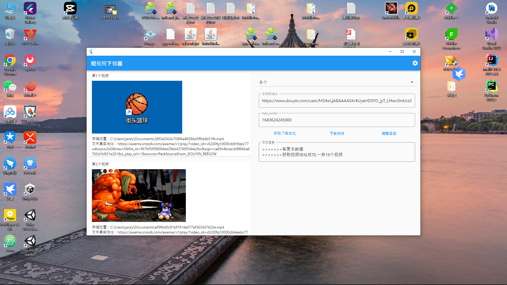
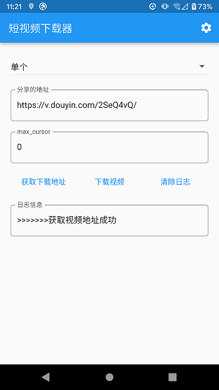
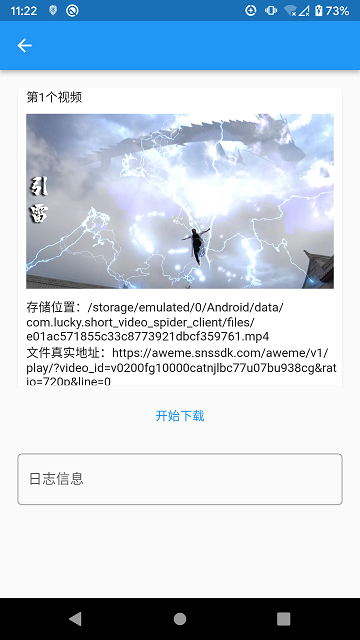
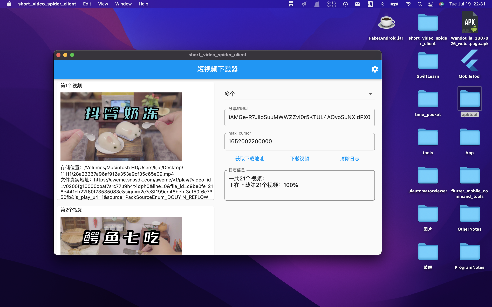
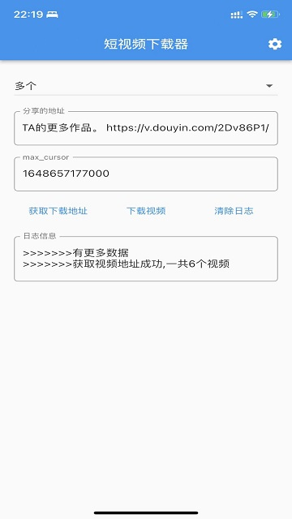
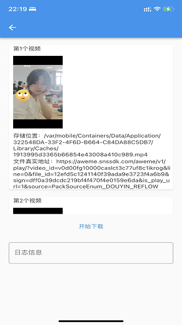

# 短视频下载器客户端

目前只支持抖音视频的下载，需要配合服务端一起使用，可以下载单个视频，也支持下载用户下的多个视频。客户端已集成线上地址，服务器是用Python去抓取真实地址的，想看服务器代码，请点[这里](https://github.com/LuckyLi706/ShortVideoSpider)，并且提供提供api接口。客户端支持Android、Windows、Macos、IOS（没有签名文件，需要自己打包），Linux（没适配）

## 编译环境
   + Flutter版本：3.0.1
   + Dart版本：2.17.1

## 功能
   + 设置功能
    右上角的设置，可以提供url和存储路径的配置。
   + 单个和多个选择框
     - 单个
       下载单个视频，复制单个视频的分享地址到下面的地址栏中。
     - 多个
       可以下载多个视频，web进入用户的主页，然后复制到下面的地址栏中，移动端可以通过分享主页复制到下面的地址栏中，下面的max_cursor的输入框可以不管。
   + 获取下载地址
     点击该按钮去获取真实的视频地址。
   + 下载视频
     获取真实地址成功之后可以点击这个按钮去下载视频。
   + 清除日志
     清除日志信息。

## 截图
   + Windows
     
   + Android
   <figure class="half">
    
    
   </figure>

   + macOS
     
   + IOS

  <figure class="half">
    
    
  </figure>

   + Linux
   
     应该没啥人使用Linux吧，哈哈哈，所以没适配。

## 免责声明
本仓库只为学习研究，如涉及侵犯个人或者团体利益，请与我取得联系，我将主动删除一切相关资料，谢谢！
